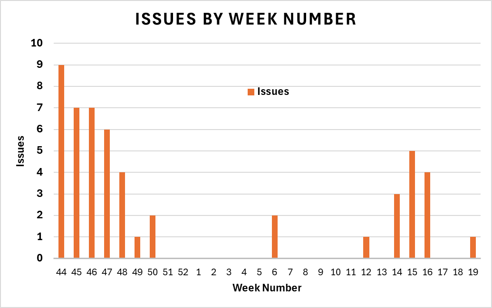

# Fuzzing CPython with fusil

## Introduction

This report presents the issues found by fuzzing [CPython](https://github.com/python/cpython)
with [fusil](https://github.com/devdanzin/fusil), a tool created by
[Victor Stinner](https://github.com/vstinner) and updated and used by
[Daniel Diniz](https://github.com/devdanzin) for this fuzzing campaign.

### Goals

The primary goal of this fuzzing campaign was to uncover defects, improve
stability, and enhance the overall robustness of CPython, particularly
focusing on new features and diverse configurations. A secondary goal was
to explore ways to improve fusil to be more effective in attaining the
primary goal.

This report intends to present the campaign, analyzing its results
quantitatively and qualitatively, issue-finding patterns, and relevance to
the CPython project. Complementarily, an assessment of the format and
procedures of the campaign should allow improvements to future efforts.

### Context on fusil

While fusil is in fact a "multi-agent Python library used to write
fuzzing programs", in this report the name will be used as shorthand to
refer to the Python fuzzer written by Stinner and enhanced by Diniz, based
on the library.

Fusil works by generating source files containing random calls using
random and/or interesting arguments, then monitoring the execution and
output of each source file. It usually finds crashes resulting from the
processing of invalid objects and unexpected call patterns.

Since Stinner's last version, new features have been added to fusil by
Diniz. These features include running the generated code in parallel
threads, testing class instances in addition to classes and functions,
and using new interesting objects and values as inputs, all of which
found new crashes. Other new features, like running the code
asynchronously or mangling objects by replacing some of their attributes,
haven't found any issues.

## Fuzzing environment and procedures

Fuzzing has started in late October 2024 and is still ongoing as of early
May 2025, meaning this report covers a period of approximately 6 months.
It has been conducted on a free AWS EC2 instance, a free AWS LightSail
instance (for 3 months), 3 free Oracle Cloud instances (2 x64, 1 ARM), a
personal desktop computer and a personal laptop.

Each fusil instance corresponds to a long-running fuzzer process that
creates the code, spawns fuzzing processes, manages sessions and collects
hits, and an ephemeral code execution process at a time. Since each
instance consists of two processes running in parallel, most of them were
assigned two CPU cores when possible.

Fusil was installed from git and many different revisions have been used
along the fuzzing period, as no recent releases are available and new
features have been constantly added.

- Concurrent fuzzing instances: 4 to 10
- Fusil versions: many different revisions
- CPython versions: 3.12, 3.13, 3.14, main
- CPython configurations: debug, release, optimized, GILful, free-threaded,
JITted, ASAN-enabled

A hit is defined as a fuzzing session where either the process ends
abnormally (a segmentation fault, an abort etc.) or a keyword indicating
abnormal conditions is matched in the output, e.g. "SystemError",
"Fatal Python error". Many false positives, especially in the beginning
of the fuzzing campaign, were recorded as hits. These became rarer as
keywords were tightened and known problematic modules were skipped.

After running the fuzzer and collecting hits in the form of long Python
source files (>15k lines per file) together with the output of their
execution, each hit is manually classified as new or duplicate. Manual
reduction of new hits and collection of corresponding backtraces is then
usually performed. In a few instances, there was usage of automatic test
case reduction tools like creduce and shrinkray.

Preliminary results were sometimes shared with CPython Core Developers in
the community Python Discord #internals-and-peps channel, where many
developers helped triage the issues, with special mentions of Peter Bierma
and Jelle Zijlstra for continued assistance.

Issues were then filled containing Minimal Reproducible Examples and,
usually, backtraces and error messages. Most issues filed this way did not
contain a diagnostic or pointed to deeper causes, except when those were
provided by Core Developers, as most cases were beyond the capabilities
of the bug reporter (Diniz) to investigate.

## Results

There was no detailed record keeping regarding fuzzing effort and hits, so
the following estimates of resources used, hits and issues found are
presented instead:

- Fuzzing time: > 25.000 hours (sum of all instances)
- Fuzzing sessions: > 1.000.000
- Hits: > 50.000
- Issues filled: 52 (X valid, Y closed, Z open)
- Resulting PRs: XX (Y open, Z closed)

The 52 issues filled correspond roughly to 30% of all the crashes (issues
with "type-crash" label) and 2% of all issues (including features requests,
bugs and invalid issues) reported in the CPython issue tracker during the
period covered by this report.

Hits and new issues don't seem to appear at a steady pace. Apparently,
there are long periods of no or nearly no new findings, followed by rapid
accumulation of new results when new features are added to fusil, or
when new CPython versions and/or configurations are added to the fuzzing
pool. Repeated hits usually stop being found when the underlying issue
is fixed in CPython, hence the high number of hits recorded. In special
cases, suppressions for specific bugs are added, also stopping repeated
hits for them.

_Graph: bugs filled by date (day? week? bar graph? with line of rolling average bugs per... 3 or 4 weeks?) annotated with dates of new features/configurations?_


The temporal pattern of issue creation shows that the highest number of
issues were found when CPython was in a "fusil-naive" state, where no
fuzzing with this tool had happened for over a decade.

_Analyze dates of new features/configurations and correlate with number of issues found._

_Table: Issue number x Kind, Configuration, Python version, Status, number of PRs_

Each issue that resulted from the reported fuzzing effort is detailed
in the **Findings** section in the **Appendix**.

_Table: number of issues by kind?_

Even though abort issues only affect debug builds directly, in many cases
they point to causes that would also create problems in release builds.
Segfault issues sound more serious, but some were very shallow crashes in
seldom used corners of CPython's standard librady.

_Table: number of issues by configuration?_

The high number of issues resulting in aborts makes debug builds the most
fruitful configuration, followed by free-threaded builds. ...

_Table or graph?: issues by estimated relevance/severity?_

The relevance/severity of crashes found was estimated with assistance from
CPython Core Developers? The tally displays how diverse fusil findings
are in terms of value to the project: some issues are trivial, others point
to deep bugs that could affect a large number of users. It should be
highlighted that the CPython developers attempt to fix all found issues,
regardless of relevance, which is a marked difference from some other
projects fuzzed with fusil.

_Table: number of PRs (including backports) by author and status_

The developer with the most PRs (XX, YY%) for the issues found with fusil
was Victor Stinner (@vstinner), followed by ... (X, Y%) and ... (Z, ZZ%).
In total, X developers created PRs to fix these issues.

## Impact

In the CPython project, developers don't assign prioritiy or severity
levels to issues. One of the issues found, #131998, was considered
relevant enough to be classified as a release blocker.

_Issues that were considered important?_
_Issues that were considered trivial?_
_Duplicate issues (some with better MREs)?_

```
Here input by core devs would be important, on positive and negative points:
- are the findings valuable?
- Is fusil/this fuzzing effort helping make CPython better?
- Is the constant filling of crashes disruptive of the normal development flow?
- Is the lack of deep analysis and diagnostics when the issues are filed
something that hinders core devs efforts?
- Would you like to see more issues found with fusil being created?
- Would you prefer that issues only be filed when they have been
diagnosed/analyzed?
```

_Maybe run a poll in discuss.python.org to collect number of developers involved_
_in diagnosing and fixing issues, and another about their opinions as listed above?_

## Conclusions

The results indicate that running a fuzzing tool with fusil's features
can be fruitful in a project like CPython. Not only a significant number
of crashes were uncovered, but also important issues were revealed by
identifying some of these crashes.

The temporal pattern of bug finding may indicate that short periodic
fuzzing campaings would have a better cost/benefit than a continuous
effort like the one presented here. New features in fusil can justify such
a campaign, while the pace of accumulation of new issues in CPython doesn't
seem to necessitate continuous monitoring.

Cultural fit? Depending on Core Devs opinions. Contrast with low interest
in some other projects.

The original design of fusil's Python fuzzer makes it well-suited for
fuzzing CPython, finding both deep, relevant bugs as well as shallow, low
value crashes. Newly added features also allowed finding both kinds of
issues, achieving the secondary goal of exploring ways to improve fusil
to better excercize CPython's code paths in pursuit of crashes.

Fuzzing CPython with fusil has proved it to be a valuable tool for
identifying and reducing software defects in that project. This means that
the primary goal of the fuzzing campaign was achieved, with relevant
contributions made to CPython's robustness.


-------------
## Apendix

### Findings

Issue titles were collected at the time of writing the report and thus can
in some cases be more descriptive than the original titles.

The "Python versions" field reports the tags used in CPython's issue
tracker, which will under-represent older versions as those tags get
removed or aren't added as versions leave the maintainance window.

The "PRs" field lists all PRs that link to the issue, regardless of
status (open, merged, closed without merging etc.).


#### 1- [126219](https://github.com/python/cpython/issues/126219) - `tkinter.Tk` segfault with invalid `className`

```python
import  _tkinter
_tkinter.create(None, '', '\U0010FFFF', None)

# OR

import tkinter
tkinter.Tk(screenName=None, baseName='', className='\U0010FFFF')
```

- Issue Number: 126219
- Date filled: 30/10/2024
- Kind: Segmentation Fault
- Configuration: release
- Python versions: 3.12, 3.13, 3.14, main
- Status: open
- PRs (author):
  - None yet

<details><summary>Backtrace/error message:</summary>
<p>


```shell
#0  0x00007ffff77bab5b in Tcl_UtfToUniChar () from /lib/x86_64-linux-gnu/libtcl8.6.so
#1  0x00007ffff77bc993 in ?? () from /lib/x86_64-linux-gnu/libtcl8.6.so
#2  0x00007ffff77bb795 in Tcl_UtfToTitle () from /lib/x86_64-linux-gnu/libtcl8.6.so
#3  0x00007ffff78b5083 in ?? () from /lib/x86_64-linux-gnu/libtk8.6.so
#4  0x00007ffff79dcf9d in Tcl_AppInit (interp=0x555555e14860) at ./Modules/tkappinit.c:40
#5  0x00007ffff79d92b4 in Tkapp_New (screenName=screenName@entry=0x0,
    className=className@entry=0x7ffff7c2c1c0 "\364\217\277\277", interactive=interactive@entry=0,
    wantobjects=wantobjects@entry=0, wantTk=wantTk@entry=1, sync=sync@entry=0, use=0x0)
    at ./Modules/_tkinter.c:730
#6  0x00007ffff79d953f in _tkinter_create_impl (module=module@entry=<module at remote 0x7ffff7ab9eb0>,
    screenName=screenName@entry=0x0, baseName=baseName@entry=0x555555c77ef0 <_PyRuntime+51344> "",
    className=className@entry=0x7ffff7c2c1c0 "\364\217\277\277", interactive=interactive@entry=0,
    wantobjects=wantobjects@entry=0, wantTk=1, sync=0, use=0x0) at ./Modules/_tkinter.c:3176
#7  0x00007ffff79d99c6 in _tkinter_create (module=<module at remote 0x7ffff7ab9eb0>, args=0x7ffff7fb0080,
    nargs=<optimized out>) at ./Modules/clinic/_tkinter.c.h:820
#8  0x00005555556f18b0 in cfunction_vectorcall_FASTCALL (
    func=<built-in method create of module object at remote 0x7ffff7ab9eb0>, args=0x7ffff7fb0080,
    nargsf=<optimized out>, kwnames=<optimized out>) at Objects/methodobject.c:436
#9  0x000055555567ba55 in _PyObject_VectorcallTstate (tstate=0x555555cbbc70 <_PyRuntime+329232>,
    callable=<built-in method create of module object at remote 0x7ffff7ab9eb0>, args=0x7ffff7fb0080,
    nargsf=9223372036854775812, kwnames=0x0) at ./Include/internal/pycore_call.h:167
```
</p>
</details>

----------

#### 2- [126220](https://github.com/python/cpython/issues/126220) - `_lsprof.Profiler._creturn_callback()` segfaults

```python
from _lsprof import Profiler
Profiler()._creturn_callback()
# OR
Profiler()._ccall_callback()
```

- Issue Number: 126220
- Date filled: 31/10/2024
- Kind: Segmentation Fault
- Configuration: release
- Python versions: 3.12, 3.13, 3.14, main
- Status: Closed-Completed
- PRs (author):
  - [126233](https://github.com/python/cpython/pull/126233) (@sobolevn)
  - [126271](https://github.com/python/cpython/pull/126271) (@sobolevn)
  - [126310](https://github.com/python/cpython/pull/126310) (@sobolevn, @erlend-aasland)
  - [126311](https://github.com/python/cpython/pull/126311) (@sobolevn, @erlend-aasland)
  - [126402](https://github.com/python/cpython/pull/126402) (@sobolevn, @erlend-aasland)


<details><summary>Backtrace/error message:</summary>
<p>


```shell
Program received signal SIGSEGV, Segmentation fault.
get_cfunc_from_callable (callable=0x0, self_arg=0x7ffff7bff710, missing=0x555555c53b80 <_PyInstrumentation_MISSING>) at ./Modules/_lsprof.c:628
628         if (PyCFunction_Check(callable)) {
(gdb) bt
#0  get_cfunc_from_callable (callable=0x0, self_arg=0x7ffff7bff710,
    missing=0x555555c53b80 <_PyInstrumentation_MISSING>) at ./Modules/_lsprof.c:628
#1  0x00007ffff79dd610 in creturn_callback (self=0x7ffff7a91050, args=<optimized out>,
    size=<optimized out>) at ./Modules/_lsprof.c:676
#2  0x000055555568f4b9 in method_vectorcall_FASTCALL (func=0x7ffff7aba630, args=0x7ffff7fb0078,
    nargsf=<optimized out>, kwnames=<optimized out>) at Objects/descrobject.c:401
#3  0x000055555567ba55 in _PyObject_VectorcallTstate (tstate=0x555555cbbc70 <_PyRuntime+329232>,
    callable=0x7ffff7aba630, args=0x7ffff7fb0078, nargsf=9223372036854775809, kwnames=0x0)
    at ./Include/internal/pycore_call.h:167
#4  0x000055555567bb74 in PyObject_Vectorcall (callable=callable@entry=0x7ffff7aba630,
    args=args@entry=0x7ffff7fb0078, nargsf=<optimized out>, kwnames=kwnames@entry=0x0)
    at Objects/call.c:327
#5  0x0000555555827d24 in _PyEval_EvalFrameDefault (
    tstate=tstate@entry=0x555555cbbc70 <_PyRuntime+329232>, frame=0x7ffff7fb0020,
    throwflag=throwflag@entry=0) at Python/generated_cases.c.h:955
#6  0x0000555555852fb7 in _PyEval_EvalFrame (throwflag=0, frame=<optimized out>,
    tstate=0x555555cbbc70 <_PyRuntime+329232>) at ./Include/internal/pycore_ceval.h:116
#7  _PyEval_Vector (tstate=tstate@entry=0x555555cbbc70 <_PyRuntime+329232>,
    func=func@entry=0x7ffff7a46450, locals=locals@entry=0x7ffff7a55df0, args=args@entry=0x0,
    argcount=argcount@entry=0, kwnames=kwnames@entry=0x0) at Python/ceval.c:1886
#8  0x0000555555853096 in PyEval_EvalCode (co=co@entry=0x7ffff7a58630,
    globals=globals@entry=0x7ffff7a55df0, locals=locals@entry=0x7ffff7a55df0) at Python/ceval.c:662
#9  0x00005555559251f4 in run_eval_code_obj (tstate=tstate@entry=0x555555cbbc70 <_PyRuntime+329232>,
    co=co@entry=0x7ffff7a58630, globals=globals@entry=0x7ffff7a55df0, locals=locals@entry=0x7ffff7a55df0)
    at Python/pythonrun.c:1338
```
</p>
</details>

----------

#### 3- [126221](https://github.com/python/cpython/issues/126221) - `sre_constants._makecodes` segfaults in JIT builds

```python

```

- Issue Number:
- Date filled:
- Kind:
- Configuration:
- Python versions:
- Status:
- PRs (author):
  - []() ()

<details><summary>Backtrace/error message:</summary>
<p>


```shell

```
</p>
</details>

----------

#### 4- [126223](https://github.com/python/cpython/issues/126223) - `SystemError` caused by `_interpreters.create()` with invalid unicode argument

```python

```

- Issue Number:
- Date filled:
- Kind:
- Configuration:
- Python versions:
- Status:
- PRs (author):
  - []() ()

<details><summary>Backtrace/error message:</summary>
<p>


```shell

```
</p>
</details>

----------

#### 5- [126312](https://github.com/python/cpython/issues/126312) - GC aborts in debug no-gil build

```python

```

- Issue Number:
- Date filled:
- Kind:
- Configuration:
- Python versions:
- Status:
- PRs (author):
  - []() ()

<details><summary>Backtrace/error message:</summary>
<p>


```shell

```
</p>
</details>

----------

#### 6- [126313](https://github.com/python/cpython/issues/126313) - `curses.napms()` aborts with a `SystemError`

```python

```

- Issue Number:
- Date filled:
- Kind:
- Configuration:
- Python versions:
- Status:
- PRs (author):
  - []() ()

<details><summary>Backtrace/error message:</summary>
<p>


```shell

```
</p>
</details>

----------

#### 7- [126314](https://github.com/python/cpython/issues/126314) - Running `tracemalloc` in threads segfaults on no-gil

```python

```

- Issue Number:
- Date filled:
- Kind:
- Configuration:
- Python versions:
- Status:
- PRs (author):
  - []() ()

<details><summary>Backtrace/error message:</summary>
<p>


```shell

```
</p>
</details>

----------

#### 8- [126315](https://github.com/python/cpython/issues/126315) - `tracemalloc` aborts when run from threads in no-gil

```python

```

- Issue Number:
- Date filled:
- Kind:
- Configuration:
- Python versions:
- Status:
- PRs (author):
  - []() ()

<details><summary>Backtrace/error message:</summary>
<p>


```shell

```
</p>
</details>

----------

#### 9- [126316](https://github.com/python/cpython/issues/126316) - `grp` is not thread safe

```python

```

- Issue Number:
- Date filled:
- Kind:
- Configuration:
- Python versions:
- Status:
- PRs (author):
  - []() ()

<details><summary>Backtrace/error message:</summary>
<p>


```shell

```
</p>
</details>

----------

#### 10- []() -

```python

```

- Issue Number:
- Date filled:
- Kind:
- Configuration:
- Python versions:
- Status:
- PRs (author):
  - []() ()

<details><summary>Backtrace/error message:</summary>
<p>


```shell

```
</p>
</details>

----------

#### 11- []() -

```python

```

- Issue Number:
- Date filled:
- Kind:
- Configuration:
- Python versions:
- Status:
- PRs (author):
  - []() ()

<details><summary>Backtrace/error message:</summary>
<p>


```shell

```
</p>
</details>

----------

#### 12- []() -

```python

```

- Issue Number:
- Date filled:
- Kind:
- Configuration:
- Python versions:
- Status:
- PRs (author):
  - []() ()

<details><summary>Backtrace/error message:</summary>
<p>


```shell

```
</p>
</details>

----------

#### 13- []() -

```python

```

- Issue Number:
- Date filled:
- Kind:
- Configuration:
- Python versions:
- Status:
- PRs (author):
  - []() ()

<details><summary>Backtrace/error message:</summary>
<p>


```shell

```
</p>
</details>

----------

#### 14- []() -

```python

```

- Issue Number:
- Date filled:
- Kind:
- Configuration:
- Python versions:
- Status:
- PRs (author):
  - []() ()

<details><summary>Backtrace/error message:</summary>
<p>


```shell

```
</p>
</details>

----------

#### 15- []() -

```python

```

- Issue Number:
- Date filled:
- Kind:
- Configuration:
- Python versions:
- Status:
- PRs (author):
  - []() ()

<details><summary>Backtrace/error message:</summary>
<p>


```shell

```
</p>
</details>

----------

#### 16- []() -

```python

```

- Issue Number:
- Date filled:
- Kind:
- Configuration:
- Python versions:
- Status:
- PRs (author):
  - []() ()

<details><summary>Backtrace/error message:</summary>
<p>


```shell

```
</p>
</details>

----------

#### 17- []() -

```python

```

- Issue Number:
- Date filled:
- Kind:
- Configuration:
- Python versions:
- Status:
- PRs (author):
  - []() ()

<details><summary>Backtrace/error message:</summary>
<p>


```shell

```
</p>
</details>

----------

#### 18- []() -

```python

```

- Issue Number:
- Date filled:
- Kind:
- Configuration:
- Python versions:
- Status:
- PRs (author):
  - []() ()

<details><summary>Backtrace/error message:</summary>
<p>


```shell

```
</p>
</details>

----------

#### 19- []() -

```python

```

- Issue Number:
- Date filled:
- Kind:
- Configuration:
- Python versions:
- Status:
- PRs (author):
  - []() ()

<details><summary>Backtrace/error message:</summary>
<p>


```shell

```
</p>
</details>

----------

#### 20- []() -

```python

```

- Issue Number:
- Date filled:
- Kind:
- Configuration:
- Python versions:
- Status:
- PRs (author):
  - []() ()

<details><summary>Backtrace/error message:</summary>
<p>


```shell

```
</p>
</details>

----------

#### 21- []() -

```python

```

- Issue Number:
- Date filled:
- Kind:
- Configuration:
- Python versions:
- Status:
- PRs (author):
  - []() ()

<details><summary>Backtrace/error message:</summary>
<p>


```shell

```
</p>
</details>

----------

#### 22- []() -

```python

```

- Issue Number:
- Date filled:
- Kind:
- Configuration:
- Python versions:
- Status:
- PRs (author):
  - []() ()

<details><summary>Backtrace/error message:</summary>
<p>


```shell

```
</p>
</details>

----------

#### 23- []() -

```python

```

- Issue Number:
- Date filled:
- Kind:
- Configuration:
- Python versions:
- Status:
- PRs (author):
  - []() ()

<details><summary>Backtrace/error message:</summary>
<p>


```shell

```
</p>
</details>

----------

#### 24- []() -

```python

```

- Issue Number:
- Date filled:
- Kind:
- Configuration:
- Python versions:
- Status:
- PRs (author):
  - []() ()

<details><summary>Backtrace/error message:</summary>
<p>


```shell

```
</p>
</details>

----------

#### 25- []() -

```python

```

- Issue Number:
- Date filled:
- Kind:
- Configuration:
- Python versions:
- Status:
- PRs (author):
  - []() ()

<details><summary>Backtrace/error message:</summary>
<p>


```shell

```
</p>
</details>

----------

#### 26- []() -

```python

```

- Issue Number:
- Date filled:
- Kind:
- Configuration:
- Python versions:
- Status:
- PRs (author):
  - []() ()

<details><summary>Backtrace/error message:</summary>
<p>


```shell

```
</p>
</details>

----------

#### 27- []() -

```python

```

- Issue Number:
- Date filled:
- Kind:
- Configuration:
- Python versions:
- Status:
- PRs (author):
  - []() ()

<details><summary>Backtrace/error message:</summary>
<p>


```shell

```
</p>
</details>

----------

#### 28- []() -

```python

```

- Issue Number:
- Date filled:
- Kind:
- Configuration:
- Python versions:
- Status:
- PRs (author):
  - []() ()

<details><summary>Backtrace/error message:</summary>
<p>


```shell

```
</p>
</details>

----------

#### 29- []() -

```python

```

- Issue Number:
- Date filled:
- Kind:
- Configuration:
- Python versions:
- Status:
- PRs (author):
  - []() ()

<details><summary>Backtrace/error message:</summary>
<p>


```shell

```
</p>
</details>

----------

#### 30- []() -

```python

```

- Issue Number:
- Date filled:
- Kind:
- Configuration:
- Python versions:
- Status:
- PRs (author):
  - []() ()

<details><summary>Backtrace/error message:</summary>
<p>


```shell

```
</p>
</details>

----------

#### 31- []() -

```python

```

- Issue Number:
- Date filled:
- Kind:
- Configuration:
- Python versions:
- Status:
- PRs (author):
  - []() ()

<details><summary>Backtrace/error message:</summary>
<p>


```shell

```
</p>
</details>

----------

#### 32- []() -

```python

```

- Issue Number:
- Date filled:
- Kind:
- Configuration:
- Python versions:
- Status:
- PRs (author):
  - []() ()

<details><summary>Backtrace/error message:</summary>
<p>


```shell

```
</p>
</details>

----------

#### 33- []() -

```python

```

- Issue Number:
- Date filled:
- Kind:
- Configuration:
- Python versions:
- Status:
- PRs (author):
  - []() ()

<details><summary>Backtrace/error message:</summary>
<p>


```shell

```
</p>
</details>

----------

#### 34- []() -

```python

```

- Issue Number:
- Date filled:
- Kind:
- Configuration:
- Python versions:
- Status:
- PRs (author):
  - []() ()

<details><summary>Backtrace/error message:</summary>
<p>


```shell

```
</p>
</details>

----------

#### - []() -

```python

```

- Issue Number:
- Date filled:
- Kind:
- Configuration:
- Python versions:
- Status:
- PRs (author):
  - []() ()

<details><summary>Backtrace/error message:</summary>
<p>


```shell

```
</p>
</details>

----------

#### - []() -

```python

```

- Issue Number:
- Date filled:
- Kind:
- Configuration:
- Python versions:
- Status:
- PRs (author):
  - []() ()

<details><summary>Backtrace/error message:</summary>
<p>


```shell

```
</p>
</details>

----------

#### - []() -

```python

```

- Issue Number:
- Date filled:
- Kind:
- Configuration:
- Python versions:
- Status:
- PRs (author):
  - []() ()

<details><summary>Backtrace/error message:</summary>
<p>


```shell

```
</p>
</details>

----------

#### - []() -

```python

```

- Issue Number:
- Date filled:
- Kind:
- Configuration:
- Python versions:
- Status:
- PRs (author):
  - []() ()

<details><summary>Backtrace/error message:</summary>
<p>


```shell

```
</p>
</details>

----------

#### - []() -

```python

```

- Issue Number:
- Date filled:
- Kind:
- Configuration:
- Python versions:
- Status:
- PRs (author):
  - []() ()

<details><summary>Backtrace/error message:</summary>
<p>


```shell

```
</p>
</details>

----------

#### - []() -

```python

```

- Issue Number:
- Date filled:
- Kind:
- Configuration:
- Python versions:
- Status:
- PRs (author):
  - []() ()

<details><summary>Backtrace/error message:</summary>
<p>


```shell

```
</p>
</details>

----------

#### - []() -

```python

```

- Issue Number:
- Date filled:
- Kind:
- Configuration:
- Python versions:
- Status:
- PRs (author):
  - []() ()

<details><summary>Backtrace/error message:</summary>
<p>


```shell

```
</p>
</details>

----------

#### - []() -

```python

```

- Issue Number:
- Date filled:
- Kind:
- Configuration:
- Python versions:
- Status:
- PRs (author):
  - []() ()

<details><summary>Backtrace/error message:</summary>
<p>


```shell

```
</p>
</details>

----------

#### - []() -

```python

```

- Issue Number:
- Date filled:
- Kind:
- Configuration:
- Python versions:
- Status:
- PRs (author):
  - []() ()

<details><summary>Backtrace/error message:</summary>
<p>


```shell

```
</p>
</details>

----------

#### - []() -

```python

```

- Issue Number:
- Date filled:
- Kind:
- Configuration:
- Python versions:
- Status:
- PRs (author):
  - []() ()

<details><summary>Backtrace/error message:</summary>
<p>


```shell

```
</p>
</details>

----------

#### - []() -

```python

```

- Issue Number:
- Date filled:
- Kind:
- Configuration:
- Python versions:
- Status:
- PRs (author):
  - []() ()

<details><summary>Backtrace/error message:</summary>
<p>


```shell

```
</p>
</details>

----------

#### - []() -

```python

```

- Issue Number:
- Date filled:
- Kind:
- Configuration:
- Python versions:
- Status:
- PRs (author):
  - []() ()

<details><summary>Backtrace/error message:</summary>
<p>


```shell

```
</p>
</details>

----------

#### - []() -

```python

```

- Issue Number:
- Date filled:
- Kind:
- Configuration:
- Python versions:
- Status:
- PRs (author):
  - []() ()

<details><summary>Backtrace/error message:</summary>
<p>


```shell

```
</p>
</details>

----------

#### - []() -

```python

```

- Issue Number:
- Date filled:
- Kind:
- Configuration:
- Python versions:
- Status:
- PRs (author):
  - []() ()

<details><summary>Backtrace/error message:</summary>
<p>


```shell

```
</p>
</details>

----------

#### - []() -

```python

```

- Issue Number:
- Date filled:
- Kind:
- Configuration:
- Python versions:
- Status:
- PRs (author):
  - []() ()

<details><summary>Backtrace/error message:</summary>
<p>


```shell

```
</p>
</details>

----------

#### - []() -

```python

```

- Issue Number:
- Date filled:
- Kind:
- Configuration:
- Python versions:
- Status:
- PRs (author):
  - []() ()

<details><summary>Backtrace/error message:</summary>
<p>


```shell

```
</p>
</details>

----------

#### - []() -

```python

```

- Issue Number:
- Date filled:
- Kind:
- Configuration:
- Python versions:
- Status:
- PRs (author):
  - []() ()

<details><summary>Backtrace/error message:</summary>
<p>


```shell

```
</p>
</details>

----------

#### - []() -

```python

```

- Issue Number:
- Date filled:
- Kind:
- Configuration:
- Python versions:
- Status:
- PRs (author):
  - []() ()

<details><summary>Backtrace/error message:</summary>
<p>


```shell

```
</p>
</details>

----------

#### - []() -

```python

```

- Issue Number:
- Date filled:
- Kind:
- Configuration:
- Python versions:
- Status:
- PRs (author):
  - []() ()

<details><summary>Backtrace/error message:</summary>
<p>


```shell

```
</p>
</details>

----------

#### - []() -

```python

```

- Issue Number:
- Date filled:
- Kind:
- Configuration:
- Python versions:
- Status:
- PRs (author):
  - []() ()

<details><summary>Backtrace/error message:</summary>
<p>


```shell

```
</p>
</details>

----------
